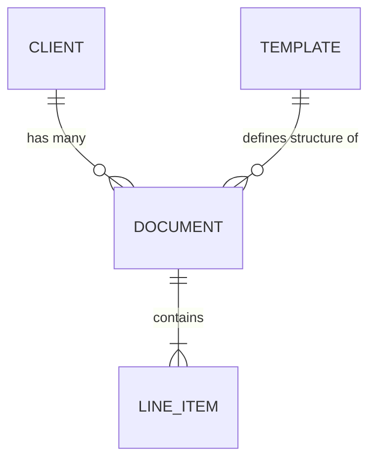

# 04 Database Design

> [!NOTE]  
> **Document Status**: Approved Architecture Draft  
> **Target Database**: MongoDB (Atlas)  
> **Local Database (Offline)**: IndexedDB (via Dexie.js for React Web)  

## 1. Architectural Strategy: The Dynamic Template Problem
EasyHisaab must support multiple document types (Catering vs Rental) without changing code. Standard RDBMS tables fail here. We will use a **Schema-less Meta pattern in MongoDB** for the Line Items.

Every Document has a strict `core` schema (Total, ClientId) and a flexible `meta` schema for items based on the Template.

## 2. Collections & Relationships

### `Templates` (Core Configuration)
Defines how a document behaves and what fields its items require.
```json
{
  "_id": "ObjectId",
  "businessType": "RENTAL", // Enum: CATERING, RENTAL, RETAIL
  "name": "Tent House Invoice",
  "itemSchema": {
    "priceRequired": true,
    "hasRentalDays": true,
    "hasUnits": false
  },
  "isActive": true
}
```

### `Clients`
The people who the documents belong to.
```json
{
  "_id": "ObjectId",
  "deviceId": "String", // Used for V1 Zero-Auth linkage
  "userId": "ObjectId", // Null in V1, populated when cloud auth is added
  "name": "Rahul Sharma",
  "phone": "+919876543210", // Optional
  "createdAt": "ISODate",
  "isDeleted": false // Soft delete
}
```

### `Documents` (The Core Ledger)
The actual list/invoice generated.
```json
{
  "_id": "ObjectId",
  "clientId": "ObjectId", // Ref -> Clients
  "templateId": "ObjectId", // Ref -> Templates
  "documentNumber": "DOC-1001",
  "status": "DRAFT", // DRAFT, GENERATED, SHARED
  "grandTotal": 4500.00, // 0 if Catering
  "items": [
    {
      "name": "Chair",
      "quantity": 100,
      "price": 10.00, // Optional based on template
      "meta": {
        "rentalDays": 2, // Dynamic based on template
        "unit": null
      },
      "lineTotal": 2000.00
    }
  ],
  "createdAt": "ISODate",
  "updatedAt": "ISODate",
  "isDeleted": false
}
```

## 3. ER Diagram (Conceptual)


## 4. Indexes for Performance
To ensure fast retrieval for users and analytics:
- `Clients`: `{ deviceId: 1, name: 1 }`
- `Documents`: `{ clientId: 1, createdAt: -1 }` (For history view)
- `Documents`: `{ deviceId: 1 }` (For syncing V1 local data)

## 5. Engineering Standards
- **Soft Delete**: No record is ever deleted. `isDeleted: true` is appended. This is crucial for offline sync conflicts.
- **Audit Fields**: Every collection must have `createdAt`, `updatedAt`, and `createdBy` (Device ID for V1).
- **Versioning**: Using Mongoose `__v` for optimistic concurrency control (preventing sync overwrites).
- **Offline Sync Strategy (CRITICAL)**:
  - React Web generates a UUID (v4) for the `_id` *before* saving to IndexedDB.
  - When syncing, the backend uses `findOneAndUpdate` with `upsert: true` on the UUID. This prevents duplicate creations if a network request drops halfway.

## 6. Future AI Scalability
By keeping the `items` array strictly structured but with a flexible `meta` object, our AI Intent Parser can output generic JSON that maps directly into the `Documents` collection regardless of the business type.
